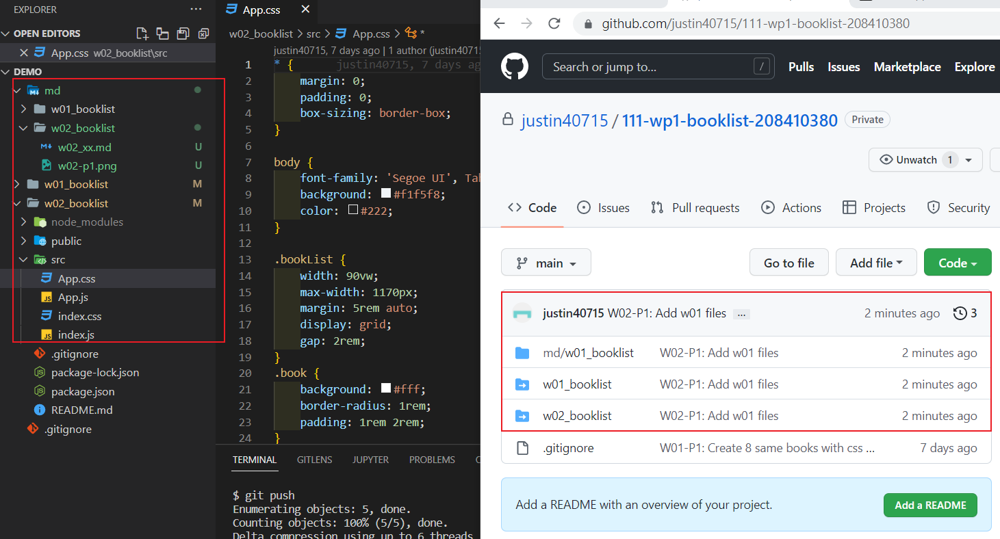
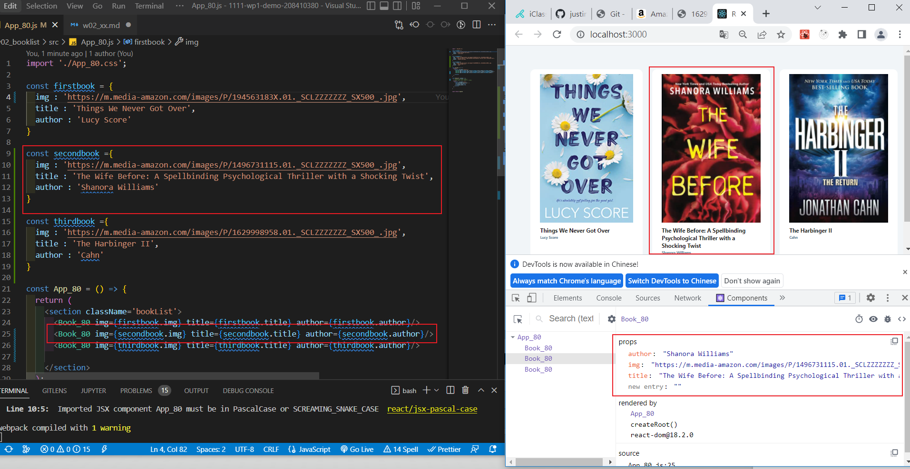
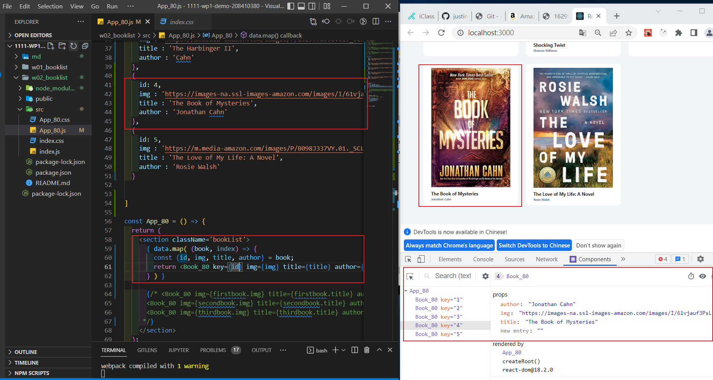

### w01-P1: create 8 same books with css booklist and book

### w02-P2: Add two more books, marked books based on your ID's last digit

### w02-P3: Add two more books (total = 5 books), marked 4th or 5th based on your ID's last digit

